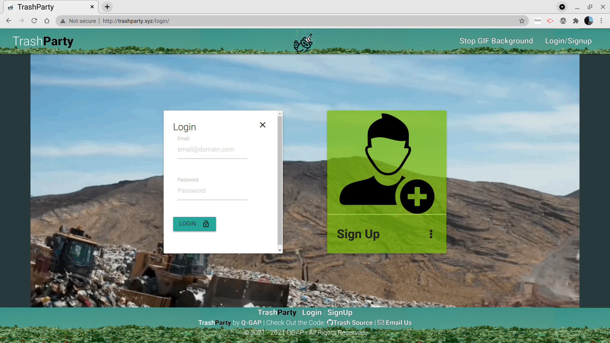
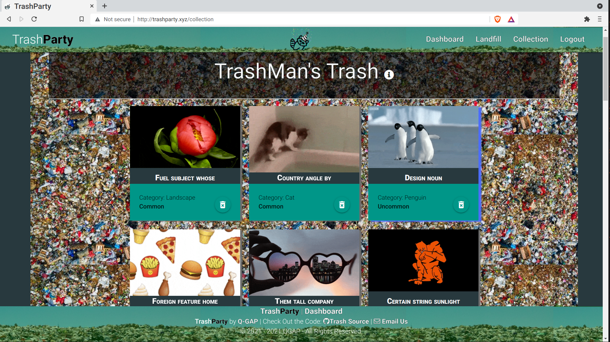
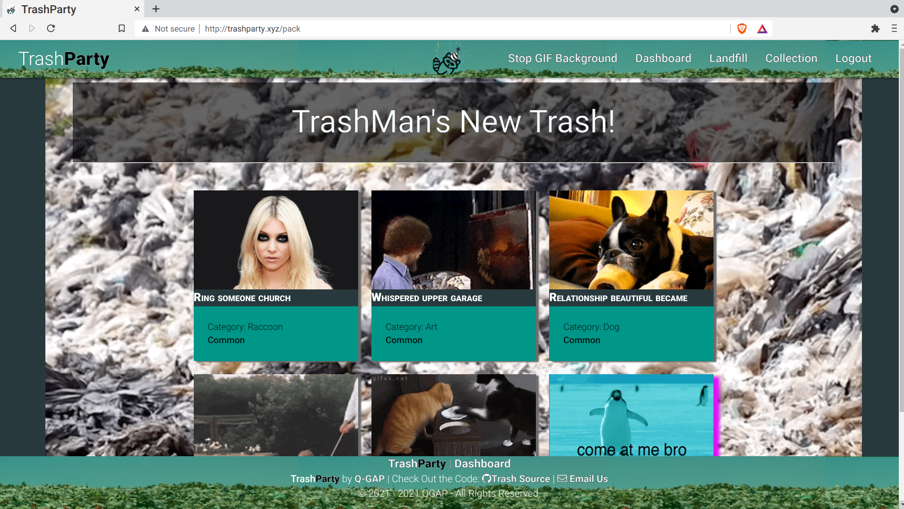
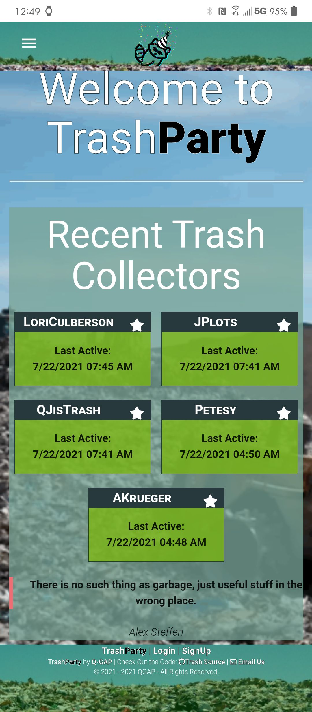
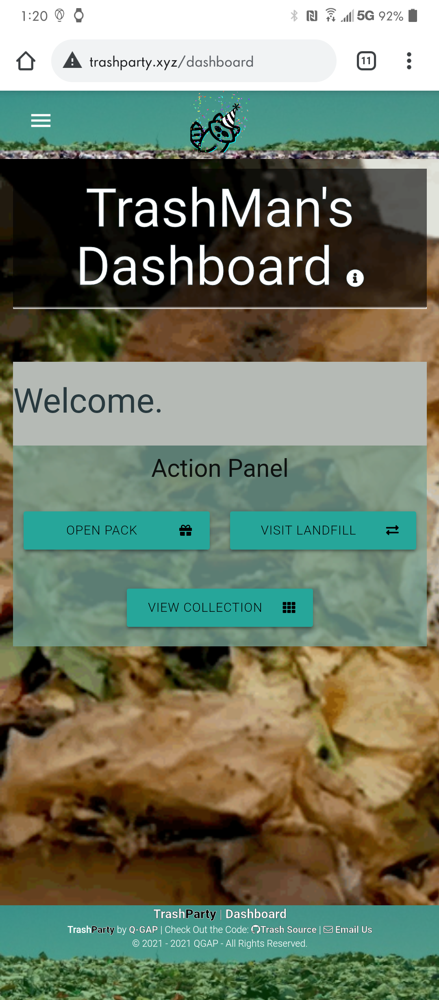
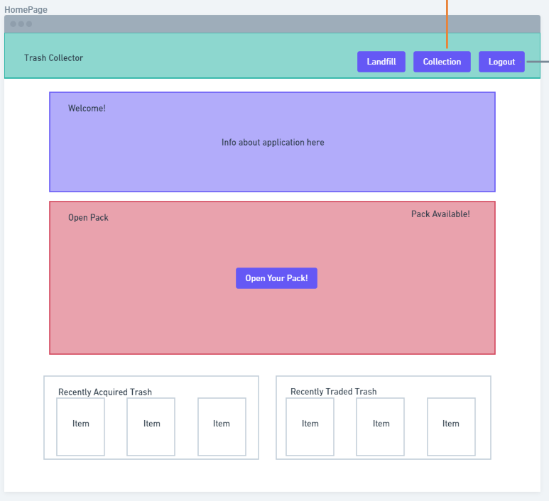
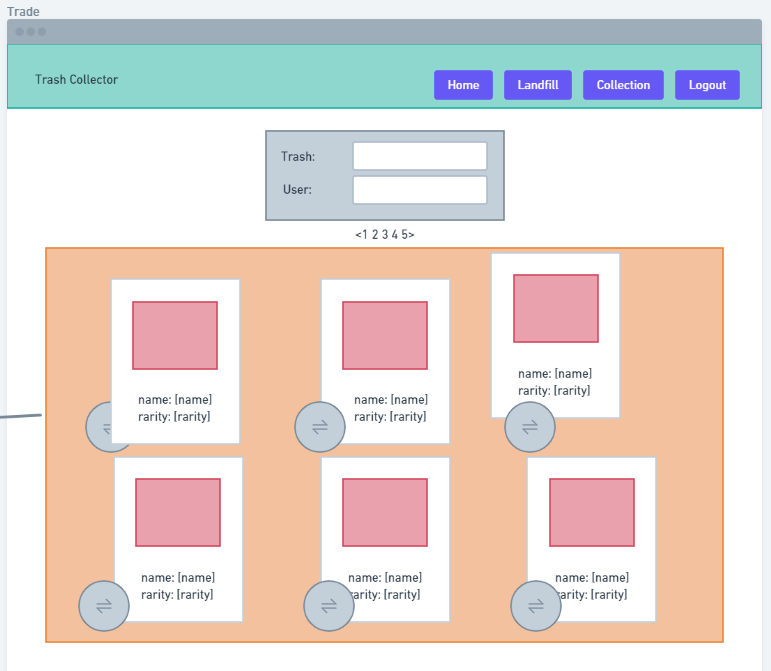
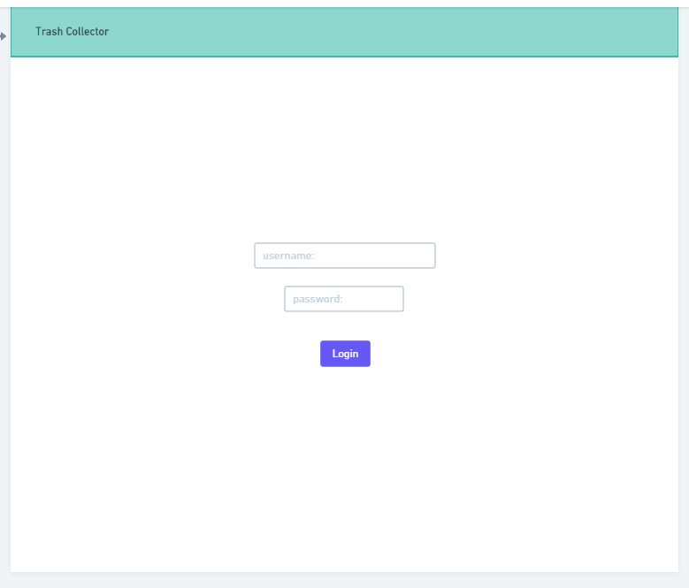

  <h1 align="center">TrashParty 🎉 </h1>
    
   
  
  ## 👇  Description  👇
---
  
  NFT-inspired Webapp  for (entertainment purposes): A website where once a day you open a pack of random stuff (data we collect from different API's). In the packs could be anywhere from songs to movies to pokemon cards, really any type of data we can get from an API and have time to implement. You can trade your "trash" with other users till you get items you actually like.
 
  ## Table of Contents 
  - [Description](#--description--)
  - [Installation Instructions 📣](#installation-instructions-)
  - [Usage 🖱️](#usage-️)
  - [Contributors 🧑‍🤝‍🧑](#contributors-)
  - [Screenshots 📷](#screenshots-)
  - [Questions ❔](#questions-)
  - [Wireframes 🖼️](#wireframes-️)
  - [License ©️](#license-️)
    
  ## Installation Instructions 📣
---
  1. Clone the repository
  2. Run |||  npm i  |||  (install dependencies)
  3. Copy [schema.sql](./db/schema.sql) into your MySQL Local Instance (Make the database)
  4. Run ||| npm run seed ||| (seeds the database with gifs)
  5. Run |||  npm run watch  |||  (starts nodemon as a daemon that restarts the server with any modifications you make)
  
  
  ## Usage 🖱️
---
  1. Upon entering the TrashParty click on Login/Signup in the upper right corner of the page.
  2. If this is your first time using this app click Sign Up and enter your credentials or proceed to Login if already signed up.
  3. Once logged in you will be brought to the homepage where you can view the most Recnt Trash Collectors who logged into the app. 
  4. From there you can use the nav links in the upper right corner of the page and even click Stop GIF Background to do just that.
  5. The Dashboard will allow you to open your pack to see what what trash (treasure) you have uncovered. 
  6. From the Dashboard, as well as the nav bar, you can also view your Collection page which lists all trash you have opened up or retireved from the Landfill. Here you can dump any of your trash into the Landfill.
  7. The Landfill can also be accessed from your Dashboard and nav bar. This is where you can add any of the seeded trash to your Collection.
  8. The TrashParty name and "Trashy" the Trash Panda mascot can be clicked to direct you to the homepage. Info circles on each page can also be clicked for further explanation of the page. 

  
  
  ## Contributors 🧑‍🤝‍🧑
---
  Peter Roto, Quanisha Jackson, Gerald Plotke, Anthony Krueger
  
  ## Screenshots 📷
---

### Desktop

 |  Login Screenshot                              | Personal Trash Pile                                            | Landfill                                               |   
|:----------------------------------:|:----------------------------------:|:----------------------------------:|
  |  |||
  |      |                |
  |         **Home (Mobile)**                                         |        **Personal Trash Pile (Mobile)**                               |     **Dashboard     (Mobile)**                                               |
  | | |
|                   |                   |
  ## WireFrames 🖼️

   |  | | 

## Questions ❔

---

  Post an issue on this repo https://github.com/Q-GAP/TrashParty. If it's urgent or there's money involved: [email us](mailto:trashparty@peterroto.com)
   
   
  :octocat: Find our team on GitHub:  
  [Q-GAP](https://github.com/Q-GAP) 
  [JQuanisha](https://github.com/jquanisha) 
  [AnthonyKrueger](https://github.com/AnthonyKrueger) 
  [GPLOTKE](https://github.com/GPLOTKE) 
  [Proto133](https://github.com/Proto133) 
   
  📬 Email us with any questions: trashparty@peterroto.com  
  
  ## License 
---
   
  This application is covered by <a href="https://opensource.org/licenses/BSD-3-Clause"> the 3-clause BSD License</a> license. 

  --------------------------- 
 

  This README was generated with [writemeREADME](https://github.com/proto133/writemeREADME) 
  
