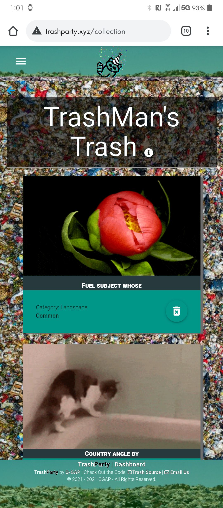

  <h1 align="center">TrashParty 🎉 </h1>
    
   
  
  ## 👇  Description  👇
---
  
  NFT-style Webapp  for (entertainment purposes): A website where once a day you open a pack of random stuff (data we collect from different API's). In the packs could be anywhere from songs to movies to pokemon cards, really any type of data we can get from an API and have time to implement. You can trade your "trash" with other users till you get items you actually like.
 
  ## Table of Contents 
  - [Description](#--description--)
  - [Installation Instructions 📣](#installation-instructions-)
  - [Usage 🖱️](#usage-️)
  - [Contributors 🧑‍🤝‍🧑](#contributors-)
  - [Screenshots 📷](#screenshots-)
  - [Questions ❔](#questions-)
  - [Wireframes 🖼️](#wireframes-️)
  - [License ©️](#license-️)
    
  ## Installation Instructions 📣
---

  
  
  ## Usage 🖱️
---

  
  
  ## Contributors 🧑‍🤝‍🧑
---
  Peter Roto, Quanisha Jackson, Gerald Plotke, Anthony Krueger
  
  ## Screenshots 📷
---

### Desktop

 |  Login Screenshot                              | Personal Trash Pile                                            | Landfill                                               |   
|:----------------------------------:|:----------------------------------:|:----------------------------------:|
  |  |||
  |      |                |
  |         **Home (Mobile)**                                         |        **Personal Trash Pile (Mobile)**                               |     **No Pack     (Mobile)**                                               |
  | | |
|                   |                   |
  ## WireFrames 🖼️

//TODO:
Anythony, please add wireframes once they are complete.

## Questions ❔

---

  Post an issue on this repo https://github.com/Q-GAP/TrashParty. If it's urgent or there's money involved: [email us](mailto:trashparty@peterroto.com)
   
   
  :octocat: Find our team on GitHub:  
  [Q-GAP](https://github.com/Q-GAP) 
  [JQuanisha](https://github.com/jquanisha) 
  [AnthonyKrueger](https://github.com/AnthonyKrueger) 
  [GPLOTKE](https://github.com/GPLOTKE) 
  [Proto133](https://github.com/Proto133) 
   
  📬 Email us with any questions: trashparty@peterroto.com  
  
  ## License 
---
   
  This application is covered by <a href="https://opensource.org/licenses/BSD-3-Clause"> the 3-clause BSD License</a> license. 

  --------------------------- 
 

  This README was generated with [writemeREADME](https://github.com/proto133/writemeREADME) 
  
