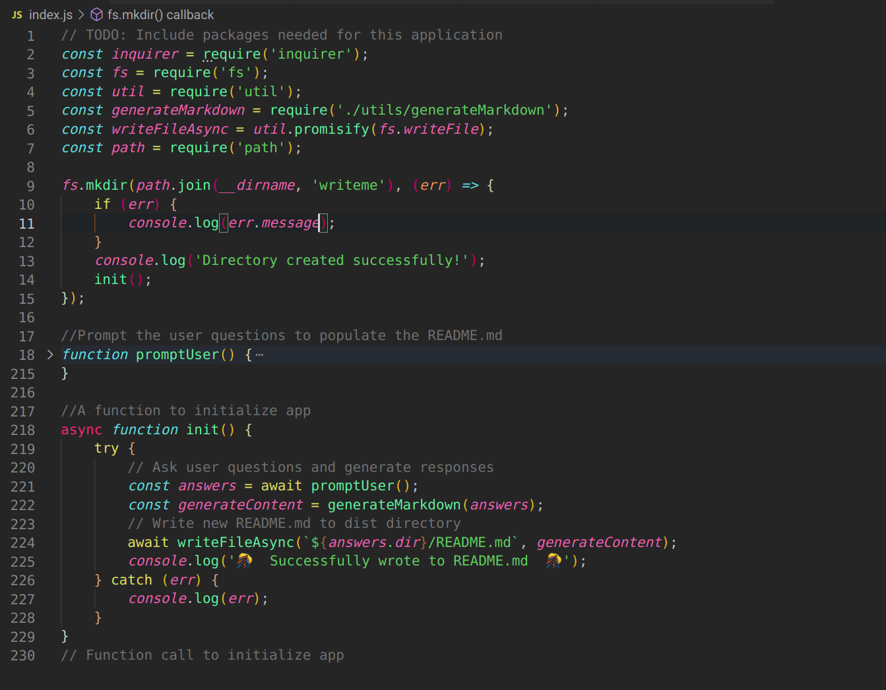
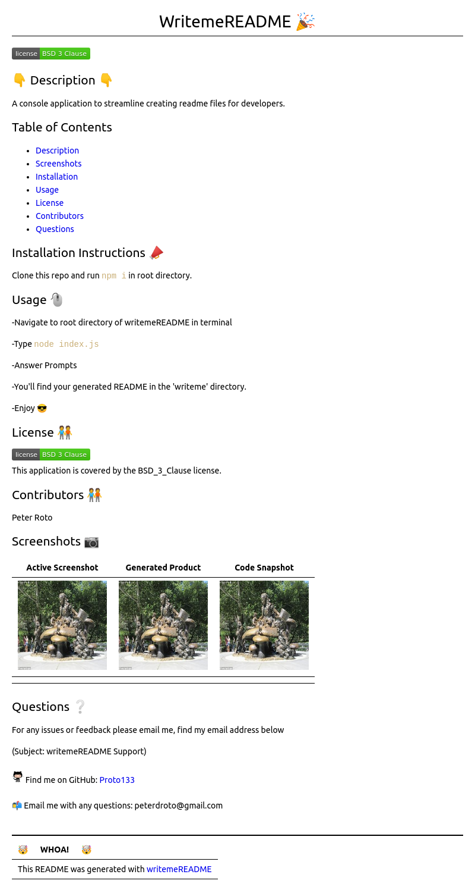
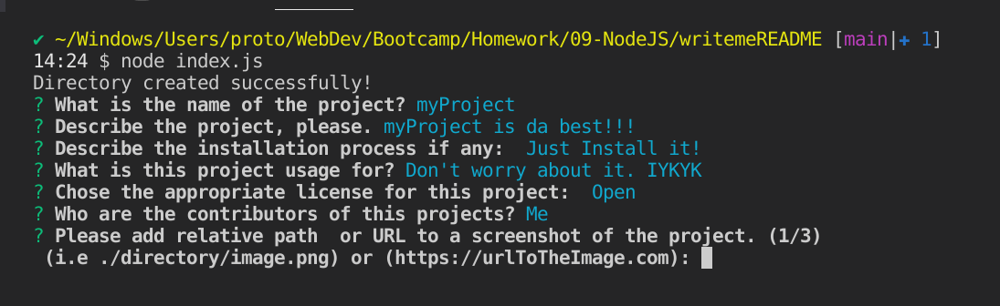

  <h1 align="center">WritemeREADME 🎉 </h1>

  <br />
  
## 👇  Description  👇

---

   A console application to streamline creating readme files for developers. Upon running WritemeREADME, the user is presented with a series of prompts that were created using [inquirer](https://www.npmjs.com/package/inquirer). After completed the application then generates a new [README.md](https://en.wikipedia.org/wiki/README) file in the specified directory (*last prompt*).

The purpose is to make writing a solid README simpler and less time consuming.

## Table of Contents

---

- [Description](#--description--)
- [Screenshots](#screenshots)
- [Installation](#installation-instructions-)
- [Usage](#usage-)
- [License](#license-)
- [Contributors](#contributors-)
- [Questions](#questions-)
  
## Installation Instructions 📣

---

### Download Manually

  1) Clone this repo
  2) Run <code>npm i</code> in root directory of your project.
  
### NPM

   ```
   npm install writemeREADME

   ```

## Usage 🖱️

---
  
### Cloned Directory

  -Navigate to root directory of writemeREADME in terminal
  
  -Type ```node index.js```  

  -Answer Prompts  

  --To test it out you can use <code>`https://loremflickr.com/320/240`</code> to generate random images as placeholders for screenshots section.

  -You'll find your generated README in the directory you designated.  
  
  -Enjoy 😎

### NPM Install

```
//imports module
const writeme = require('writemereadme')

//calls the function
writeme.init();

```
- Then just use the application

---

*Alternatively, you can very easily not answer any of the prompts and just let it create a nice template for you to fill out at your leisure.*

---

## License 🧑‍🤝‍🧑


<br />
This application is covered by the BSD_3_Clause license.

## Contributors 🧑‍🤝‍🧑

Peter Roto

## Screenshots & Video 📷

| Code Snapshot                                          | Generated Product                                      |  Active Screenshot                                     |
|:------------------------------------------------------:|:------------------------------------------------------:|:------------------------------------------------------:|
|<a href="./images/writemeREADME_snippet.png" target="_blank"></a> |<a title="Click for README.md" target="_blank" href="./README.md"></a>|<a href="./images/writemeREADME_Active.png" target="_blank"> </a>|
|                                                        |                                                        |                                                        |

### Video

[](https://youtu.be/Kh4zlCA8oC8 "writemeREADME Demo")

## Questions ❔

---

  For any issues or feedback please email me, find my email address below

  (Subject: writemeREADME Support)<br />
<br />
:octocat: Find me on GitHub: [Proto133](https://github.com/Proto133)<br />
<br />
📬 Email me with any questions: peterdroto@gmail.com<br /><br />

----
| 🤯 &#8195; WHOA! &#8195; 🤯|
|:----|
|This README was generated with [writemeREADME](https://github.com/proto133/writemeREADME) |
|  |
